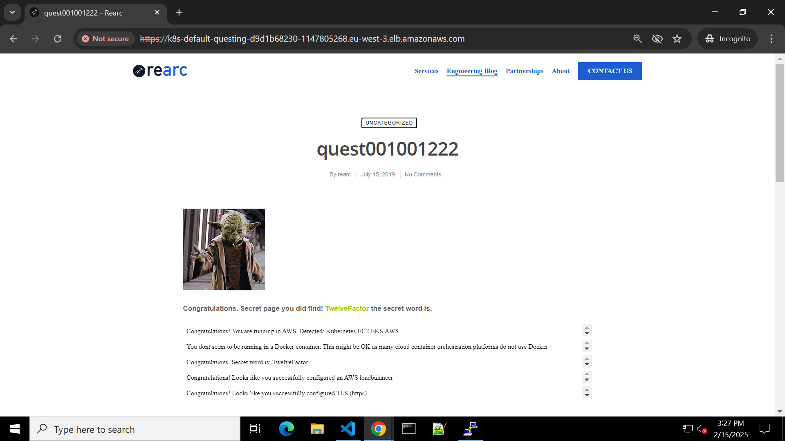

# Cloud Quest Infrastructure and Application Deployment



This repository contains an automated infrastructure deployment solution using GitHub Actions to provision and manage a complete AWS infrastructure for the Cloud Quest application. The solution implements Infrastructure as Code (IaC) using Terraform and includes automated application deployment to Amazon EKS.

## Architecture Overview

The solution deploys:
- Amazon Elastic Kubernetes Service (EKS) cluster
- Amazon Elastic Container Registry (ECR)
- AWS Load Balancer Controller
- SSL/TLS certificate management
- Kubernetes resources (Deployments, Services, Ingress)

## Prerequisites

Before running the workflow, ensure you have:

1. An AWS account and an IAM role with the necessary permissions, including an access key and secret key.
2. Configure the GitHub Repository Secrets as follows:
   - `AWS_ACCESS_KEY_ID`
   - `AWS_SECRET_ACCESS_KEY`
3. An EC2 Key Pair created in your Target AWS Region.

## Cost Considerations

Monitor costs associated with:
- EKS Cluster running hours
- EC2 Instances in the Node Group
- Load Balancer usage
- ECR Storage, S3 Bucket and Data Transfer

## Quick Start

1. Navigate to the "Actions" tab in your GitHub repository.
2. Select the "Cloud Quest Infrastructure and Application Deployment" workflow.
3. Click "Run workflow".
4. Fill in the required parameters:
   - **Cluster name**: Name of the EKS cluster.
   - **AWS region**: Region for deployment.
   - **EC2 key pair name**: Name of the EC2 key pair.
   - **Instance type**: Type of EC2 instance for worker nodes.
   - **ECR repository name**: Name of the ECR repository.
   - **S3 Bucket name**: Name of the S3 bucket for remote statefile storage
5. Click "Run workflow".

## Workflow Parameters

| Parameter          | Description                          | Default Value |
|--------------------|--------------------------------------|---------------|
| `clustername`      | Name of the EKS cluster              | `test`    |
| `region`           | AWS region for deployment            | `us-east-1`   |
| `keypair_name`     | EC2 key pair name                    | `test-quest` |
| `instancetype`     | EC2 instance type for worker nodes   | `t3.small`    |
| `ecr_repository_name` | Name of the ECR repository       | `quest`       |
| `s3_bucket_name` | Name of the S3 bucket for remote statefile storage | `quest-statefiles-bucket`       |


## Deployment Process

The workflow executes the following steps:

1. **Tool Installation and AWS CLI Configuration**
   - Install the following tools:
      - AWS CLI
      - eksctl
      - kubectl
      - Helm
      - Docker
      - Terraform
   - Once the tools are installed using the GitHub repository secrets, configure the AWS CLI.

2. **ECR Repository Setup**
   - Replaces `PLACEHOLDER_S3_BUCKET_NAME` and `PLACEHOLDER_CLUSTER_NAME` in `backend.tf` for managing the remote state file based on user input.
   - Creates an ECR Repository with the statefile stored in a remote S3 bucket using Terraform.
   - Builds and pushes the Docker image of the application to the ECR repository.
   - Updates the `deployment.yaml` file by replacing `PLACEHOLDER_IMAGE_ID` with the new image ID of the latest version.

3. **EKS Cluster Deployment**
   - Replaces `PLACEHOLDER_S3_BUCKET_NAME` and `PLACEHOLDER_CLUSTER_NAME` in `backend.tf` for managing the remote statefile based on user input.
   - Creates an EKS cluster with the statefile stored in a remote S3 bucket using Terraform.
   - Configures access to the EKS cluster on local or CI/CD runner machines using kubectl for cluster management.
     
4. **Configuring the Environment for Application Deployment with Bash Scripts**
   - Replaces all necessary `PLACEHOLDER` parameters to ensure the installation of the AWS Load Balancer Controller.
   - Installs the AWS Load Balancer Controller using a Bash script (`quest/lb-controller-installation.sh`).
   - Generates and imports self-signed SSL certificates into Amazon Certificate Manager(ACM) using a Bash script (`quest/ssl-certificate-generation.sh`).
     
5. **Application Deployment**
   - Deploys the application, service and ingress with HTTPS support with ALB(Application Load Balancer)

5. **POST Application Deployment**
   - Provides an HTTPS-based Application Access URL, secured with a self-signed SSL certificate.

## Security Features

- Automated SSL/TLS certificate management.
- Secure handling of secrets through GitHub Actions.
- AWS credentials cleanup after deployment.
- HTTPS-enabled ingress.

## Monitoring and Access

After successful deployment, you can:

1. Access the application via the HTTPS URL present in the workflow.
2. Monitor the cluster using:
   ```bash
   aws eks --region <your-region> update-kubeconfig --name <cluster-name>
   kubectl get nodes
   kubectl get pods
   ```

## Maintenance and Updates

To update the application:

1. Modify the application code
2. Push changes to the repository
3. Re-run the deployment workflow

To destroy the infrastructure:
- Run the `destruction.yaml` workflow
- Ensure proper cleanup of AWS resources

## Troubleshooting

Common issues and solutions:

1. **Workflow Failures**
   - Verify AWS credentials and check if the role have all necessary permissions are correctly configured
   - Check AWS service quotas
   - Review GitHub Actions logs

2. **Access Issues**
   - Confirm security group configurations
   - Verify IAM roles and permissions
   - Check kubectl configuration

## Support

For issues and support:
1. Review [AWS EKS documentation](https://docs.aws.amazon.com/eks/latest/userguide/what-is-eks.html)
2. Review [Terraform documentation](https://developer.hashicorp.com/terraform/tutorials/kubernetes/eks)
